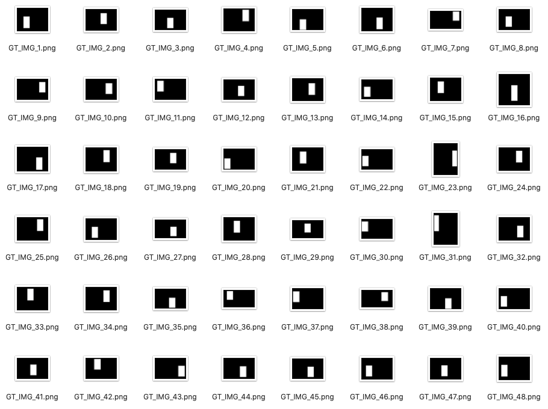

# Crowd Counting With Partial Annotations in an Image

This repo is the official implementation of paper "Crowd Counting With Partial Annotations in an Image" ([ICCV2021](https://openaccess.thecvf.com/content/ICCV2021/papers/Xu_Crowd_Counting_With_Partial_Annotations_in_an_Image_ICCV_2021_paper.pdf)).

## Usage

### Generate Random Masks

Firstly, modify the dataset root and change the root on your disk in line 13 on 'data_prapare/make_dataset_generate_masks.py': 

`
raw_data_root = '/p300/2020-Counting/datasets/raw/' + dataset_name + '/train_data/'
`

For example, to generate the random picked masks 10% on Part A, where the raw_data_root is '/p300/2020-Counting/datasets/raw/part_A_final/train_data/'
run:

`
python data_prapare/make_dataset_generate_masks.py
`

It will generate the random 10% mask on the root '/p300/2020-Counting/datasets/masked_data/part_A_final/train_data/2020_12_16_v2_rand_mask/'. 

We also upload the generated masks in our experiment in [Google Drive](https://drive.google.com/drive/folders/1FSutJhSMa-FP4dDlz4R-UiaYMVAB6EMk?usp=sharing) and here are some examples.

